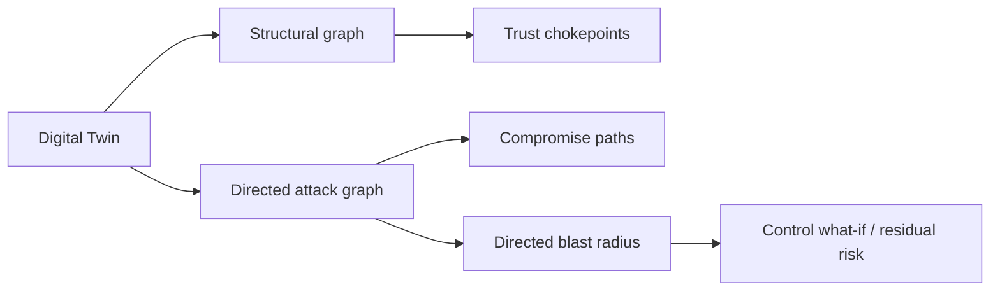

<div align="center">

# 🧠🛡️ AI Data Center Security Digital Twin

### Cyber-Physical Security Simulation · Directed Blast Radius · Multivariate Telemetry ML

[](https://www.python.org/)
[](https://github.com/VinayK88/ai-datacenter-security-digital-twin/actions/workflows/ci.yml)
[](api/app.py)
[](dashboard/app.py)
[](#multivariate-temporal-ml)
[](Dockerfile)
[](#evaluation-boundary)

> **Core question:** What is happening across an AI data center, what can compromise reach, and when do multiple cyber-physical telemetry signals become abnormal together?

</div>

---


An AI data center is a tightly coupled cyber-physical system. A single trust relationship can connect a **BMC, PDU, GPU host, Kubernetes control plane, privileged workload, identity service, object store, model registry and high-value model artifact**.

This project combines deterministic architecture reasoning with a separate learned telemetry layer:

```text
Digital twin topology
        +
Directed attack graph
        +
Counterfactual blast radius
        +
Control / resilience analysis
        +
Multivariate temporal ML
        ↓
Explainable AI-infrastructure security evidence
```

The graph, blast-radius and resilience engines remain authoritative for architecture questions. **ML ranks unusual telemetry windows; it does not invent attack paths or override hard controls.**

## Synthetic environment

The default twin contains **57 synthetic assets** across:

| Layer | Examples |
| --- | --- |
| Physical / management | racks, PDUs, BMCs |
| Compute | GPU nodes and GPUs |
| Network | perimeter, spine and top-of-rack switches |
| Platform | Kubernetes control plane and workloads |
| Identity | identity service, privileged admin, ML engineer |
| AI / data | object storage, model registry, foundation-model artifact |

## Two graphs, two questions

The project intentionally separates structural dependency from compromise direction.



A structural connection does not automatically imply reverse administrative compromise.

## Cross-domain telemetry

The synthetic telemetry layer spans:

```text
GPU utilization
gpu power draw
network egress
identity auth failures
BMC commands
Kubernetes pod creation
model-registry reads
temperature
PDU commands
rack power
```

The original transparent per-event baseline scoring is preserved for simple inspection. A new learned layer asks a harder question: **is the combination and temporal movement of these signals unusual relative to normal multi-domain behavior?**

## Multivariate temporal ML

The project now includes a **PCA reconstruction-error anomaly model** using scikit-learn.

### Reference population

The model learns from **16 deterministic synthetic normal telemetry runs** generated from different fixed seeds. No attack labels are used to fit the PCA model.

### Feature engineering

Each minute is represented by 20 features:

```text
10 normalized telemetry deviations (z-style features)
+
10 minute-to-minute change features (temporal deltas)
```

The feature set therefore captures both **state** and **movement**. For example, an egress value may be moderately unusual by itself, while an abrupt egress increase combined with model reads and identity anomalies can create a much larger multivariate reconstruction error.

When multiple sources emit the same metric in one minute, the feature builder preserves the observation furthest from the normal baseline instead of averaging the spike away.

### Model

```text
normal minute windows
       ↓
StandardScaler
       ↓
PCA retaining ≥95% reference variance
       ↓
reconstruction residual
       ↓
mean squared reconstruction error
       ↓
anomaly percentile vs normal reference
```

For each ranked minute the model reports:

- anomaly percentile;
- reconstruction error;
- top contributing feature residuals.

This makes the anomaly output inspectable rather than returning only a single opaque score.

## Synthetic scenario evaluation

The project reuses its five defensive simulation scenarios:

```text
bmc_compromise
model_exfiltration
rogue_workload
cryptomining
power_control_abuse
```

For each scenario, the evaluation checks whether the top-ranked multivariate anomaly minutes overlap with the **synthetically injected signal minutes**.

The resulting scenario surface rate is a reproducibility check for the ranking pipeline—not production attack-detection recall.

## Example reasoning

A single signal:

```text
GPU utilization = high
```

may be normal training activity.

A coordinated window such as:

```text
privileged workload creation
+ sudden GPU utilization change
+ model-registry read burst
+ network egress increase
+ power / thermal movement
```

is more interesting because the PCA model evaluates the joint deviation from learned normal behavior.

The graph layer can then independently answer which systems are reachable and what controls change the blast radius.

## Defensive scenarios

| Scenario | Initial surface | Domains crossed |
| --- | --- | --- |
| `bmc_compromise` | management plane | BMC → compute → workload → model/data |
| `model_exfiltration` | ML identity | IAM → registry → storage → network |
| `rogue_workload` | Kubernetes | control plane → workload → host → model |
| `cryptomining` | workload | workload → GPU → power → network |
| `power_control_abuse` | privileged operations | IAM → PDU → GPU node → workload |

These are abstract defensive simulations, not exploit instructions.

## API

```bash
python -m venv .venv
source .venv/bin/activate
python -m pip install -r requirements-api.txt -r requirements-dashboard.txt
uvicorn api.app:app --reload
```

Key endpoints:

```text
GET  /health
GET  /twin
GET  /chokepoints
POST /simulate
GET  /ml/telemetry?scenario=normal&limit=10
GET  /ml/telemetry?scenario=model_exfiltration&limit=10
```

`POST /simulate` also includes the top multivariate-ML anomaly minutes alongside deterministic risk, blast-radius and resilience evidence.

## Streamlit workbench

```bash
streamlit run dashboard/app.py
```

The existing security workbench provides operational views for topology, attack paths, risk/telemetry, blast radius, trust chokepoints, control what-if and counterfactual actions.

## Run tests

```bash
python -m unittest discover -s tests -v
python -m digital_twin.demo
```

GitHub Actions validates Python **3.11 and 3.12**, including:

```text
unit + API tests
digital-twin simulation
multivariate telemetry ML
module compilation
runtime imports
FastAPI smoke test
Streamlit smoke test
Docker build on Python 3.12
```

## Architecture principles

- **Direction matters.** Attack edges are not assumed reversible.
- **ML is a telemetry layer, not an attack-path oracle.**
- **Counterfactual controls remain explicit.** Defensive assumptions can be changed and residual risk recomputed.
- **Evidence stays inspectable.** Top residual features explain anomaly minutes.
- **Synthetic data is explicit.** The project avoids pretending lab telemetry proves production detection efficacy.

## Production evolution

A production implementation could use authorized GPU/BMC/Kubernetes/network/identity telemetry, workload-aware seasonality, rolling windows, robust covariance or autoencoder comparisons, online drift monitoring, alert-volume calibration, real topology inventory and SOC analyst feedback.

Model thresholds should be validated against operational false-positive cost and workload schedules rather than copied from this synthetic reference.

## Evaluation boundary

All assets, trust relationships, telemetry and attack scenarios are **synthetic**. The PCA model demonstrates multivariate temporal feature engineering, unsupervised reconstruction-based anomaly ranking and integration with a cyber-physical security twin.

It does **not** establish production precision/recall, compromise probability, or real AI-infrastructure attack detection.

The repository does not access real BMCs, GPUs, clusters, identities, model registries or production credentials.

---

<div align="center">

**Telemetry tells you what looks unusual. The digital twin tells you why it matters systemically.**

</div>
