<div align="center">

# 🧠🛡️ AI Data Center Security Digital Twin

### Counterfactual cyber-risk, resilience, and directed blast-radius simulation for GPU clusters and AI infrastructure

[](https://www.python.org/)
[](https://github.com/VinayK88/ai-datacenter-security-digital-twin/actions/workflows/ci.yml)
[](api/app.py)
[](dashboard/app.py)
[](Dockerfile)
[](#safety-and-scope)

**Model → observe → attack-simulate → correlate → trace → rank → blast-test → harden → compare residual risk**

</div>

---

An AI data center is a tightly coupled cyber-physical system. A single trust relationship can connect a **BMC, PDU, GPU host, Kubernetes control plane, privileged workload, identity service, object store, model registry, and high-value model artifact**.

This repository builds a synthetic security digital twin and asks four questions that isolated alert streams do not answer well:

> **What is happening?** — correlate security + infrastructure telemetry.
>
> **What can an attacker plausibly reach?** — traverse directional trust and compromise paths.
>
> **What matters systemically?** — identify blast radius and structural trust chokepoints.
>
> **Which controls change the outcome?** — compare raw vs. residual risk under explicit defensive assumptions.

The core simulator is intentionally dependency-light. Graph traversal, telemetry generation, anomaly scoring, attack simulation, chokepoint analysis, blast-radius analysis, and control what-if calculations use only the Python standard library.

## Dashboard preview

<p align="center">
  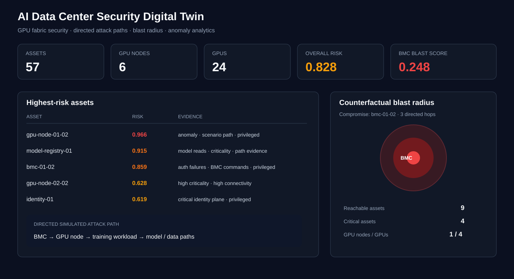
</p>

The Streamlit workbench exposes **seven operational views**: Digital Twin, Attack Path, Risk & Telemetry, Blast Radius, Trust Chokepoints, Control What-if, and Counterfactual Actions.

## The digital twin in one picture

<p align="center">
  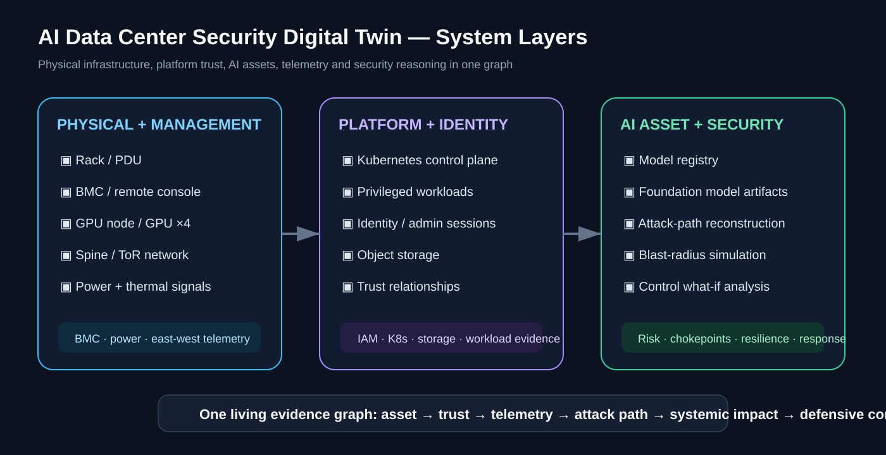
</p>

| Layer | Examples |
| --- | --- |
| Physical / management | rack, PDU, BMC, GPU node, GPU, ToR / spine fabric |
| Platform / identity | Kubernetes control plane, workload, admin identity, object storage |
| AI / security | model registry, model artifact, attack paths, blast radius, resilience |

## Two graphs, two different questions

A key design decision is to avoid treating every infrastructure relationship as reversible.

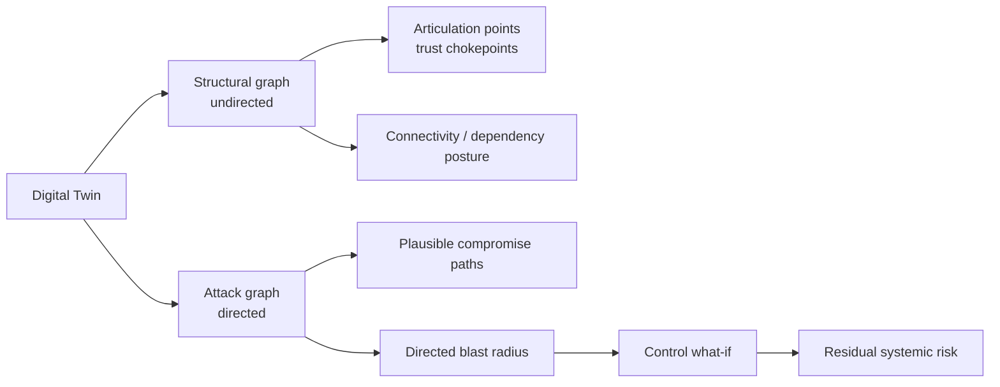

The **structural graph** represents dependency/adjacency and is deliberately undirected for architectural posture analysis. The **attack graph** separately encodes directional compromise possibilities such as:

```text
BMC → GPU node
Identity service → Kubernetes control plane
Kubernetes control plane → GPU nodes
GPU node → workload / local GPUs
Workload → model registry / object storage
Model registry → model artifact
PDU → GPU node
```

This prevents a compromised GPU node from automatically inheriting reverse administrative access to its BMC, identity service, or control plane merely because those systems are structurally connected.

## 60-second architecture

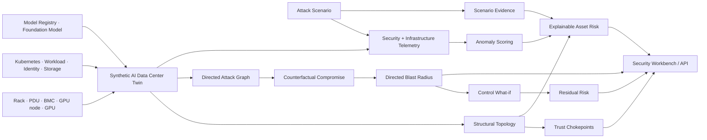

## Default synthetic environment

The deterministic twin contains **57 synthetic assets**:

| Layer | Assets |
| --- | --- |
| Physical / management | 2 racks, 2 PDUs, 6 BMCs |
| Compute | 6 GPU nodes, 24 GPUs |
| Network | perimeter firewall, spine, 2 top-of-rack switches |
| Kubernetes | control plane + 6 training workloads |
| Identity | identity service, privileged admin, ML engineer |
| AI / data | object storage, model registry, `foundation-model-v3` |

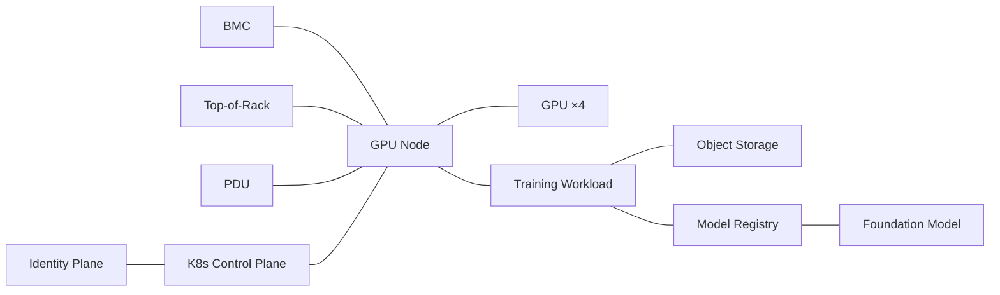

## Cross-domain telemetry fusion

<p align="center">
  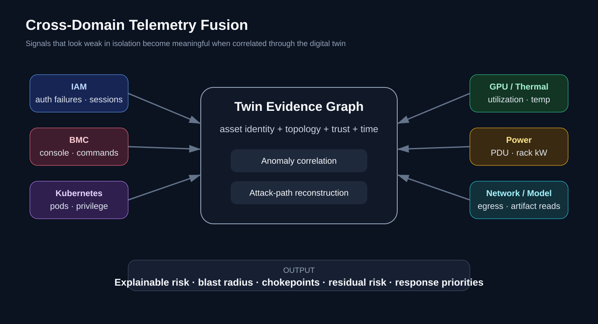
</p>

The simulator correlates signals that would normally live in different platforms:

```text
Identity       auth failures · privileged sessions
BMC            remote console · management commands
Kubernetes     pod creation · privileged workload activity
GPU            utilization · power draw
Thermal        temperature changes
Power          PDU commands · rack-level power draw
Network        east-west / egress volume
Model layer    model-registry artifact reads
```

A high GPU-utilization event alone may be normal. The same signal following a privileged workload creation, management-plane anomaly, and unusual egress is more meaningful when evaluated against topology and scenario evidence.

## Simulated defensive scenarios

| Scenario | Initial surface | Main domains crossed | Illustrative outcome |
| --- | --- | --- | --- |
| `bmc_compromise` | remote management plane | BMC → compute → workload → model/data | privileged workload + model access |
| `model_exfiltration` | stolen ML identity | IAM → registry → storage → network | bulk model artifact transfer |
| `rogue_workload` | Kubernetes control plane | K8s → workload → host → model | unsigned privileged execution |
| `cryptomining` | compromised workload | workload → GPU → power → network | off-schedule GPU resource hijack |
| `power_control_abuse` | privileged operations session | IAM → PDU → GPU node → workload | cyber-physical service disruption |

Scenario steps use representative ATT&CK-style technique names to communicate defensive intent. They are abstract simulations, not exploit instructions.

## Example — BMC compromise

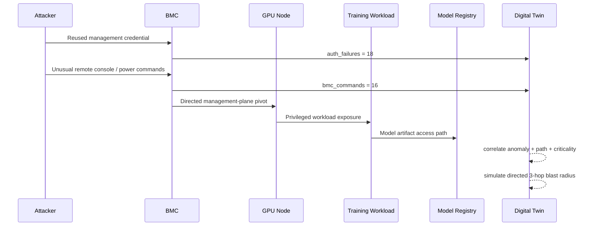

The deterministic fixture preserves these top risk signals:

| Asset | Risk | Why it rises |
| --- | ---: | --- |
| `gpu-node-01-02` | **0.9660** | max anomaly + scenario exposure + privilege + connectivity |
| `model-registry-01` | **0.9149** | criticality + model-read anomaly + path exposure |
| `bmc-01-02` | **0.8593** | authentication/BMC-command anomaly + privileged surface |

Overall synthetic environment risk: **0.8284**.

## Directed counterfactual blast-radius simulation

The twin can ask:

```text
WHAT IF bmc-01-02 IS COMPROMISED RIGHT NOW?
```

and traverse only the **directed compromise graph** for the selected hop budget.

<p align="center">
  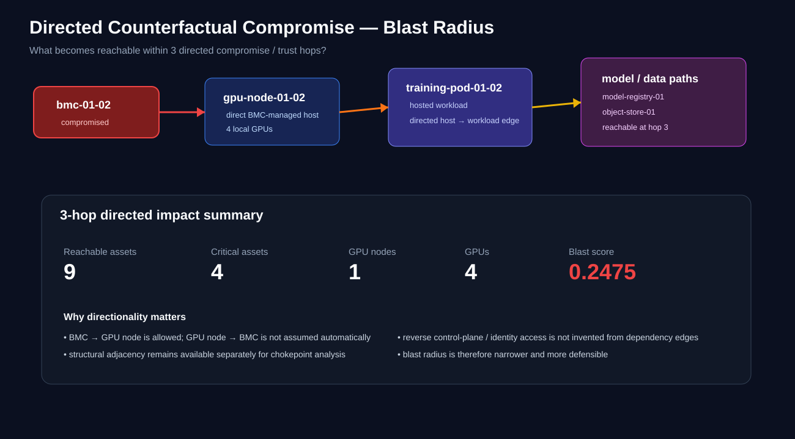
</p>

### Deterministic 3-hop comparison

| Metric | BMC compromise | Kubernetes control-plane compromise |
| --- | ---: | ---: |
| Reachable assets | **9** | **40** |
| Critical assets | **4** | **10** |
| GPU nodes exposed | **1** | **6** |
| GPUs exposed | **4** | **24** |
| Workloads exposed | **1** | **6** |
| Model assets exposed | **0** | **1** |
| Blast score | **0.2475** | **0.6331** |

The distinction is intentional: **local risk and systemic impact are different quantities**, and directionality prevents the impact model from overstating reverse access.

The executable fixture is locked to [`reports/baseline-evaluation.json`](reports/baseline-evaluation.json) by automated report-consistency tests.

## Systemic trust chokepoints

<p align="center">
  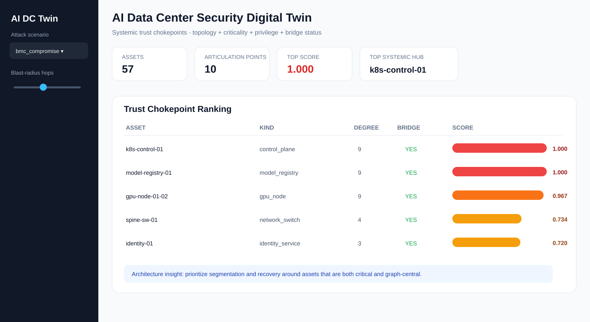
</p>

<p align="center">
  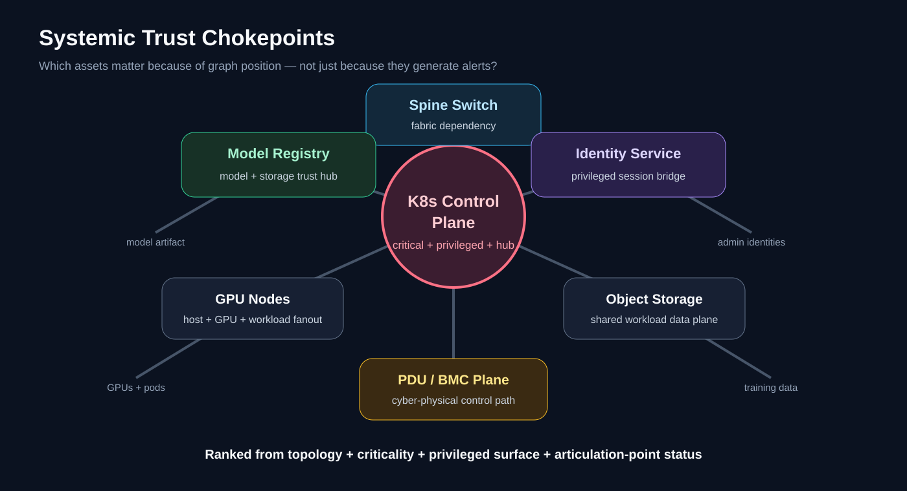
</p>

`digital_twin/attack_surface.py` uses the structural graph to calculate articulation points and rank architectural trust hubs:

```text
42% normalized graph degree
33% asset criticality
17% articulation-point status
 8% privileged-surface adjustment
```

The deterministic posture report contains **10 articulation points**. Top systemic hubs include:

| Asset | Chokepoint score | Why it matters |
| --- | ---: | --- |
| `k8s-control-01` | **1.000** | privileged control-plane hub, high degree, articulation point |
| `model-registry-01` | **1.000** | model/storage trust hub, high degree, articulation point |
| all 6 GPU nodes | **0.967** | host + GPU + workload fanout, tied articulation points |

The tie is explicit in [`reports/security-posture.json`](reports/security-posture.json), avoiding arbitrary claims that one identically modeled GPU node is inherently more systemic than another.

## Defensive control what-if simulation

<p align="center">
  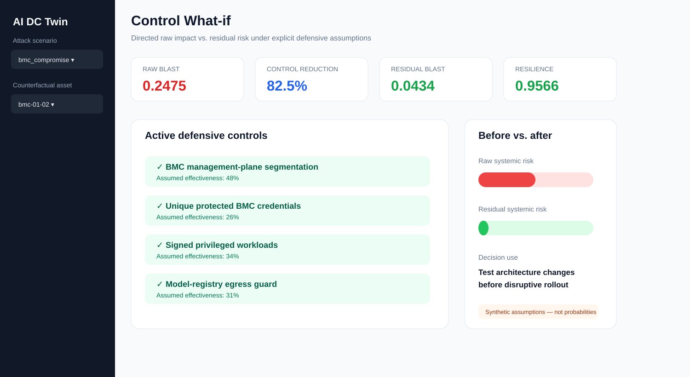
</p>

<p align="center">
  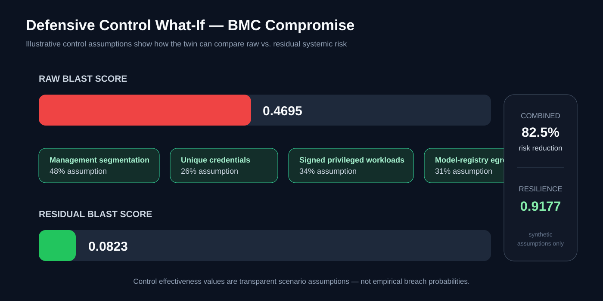
</p>

For the BMC scenario, the synthetic control catalog includes:

| Control | Illustrative effectiveness assumption |
| --- | ---: |
| management-plane segmentation | 48% |
| unique / strongly protected BMC credentials | 26% |
| signed privileged-workload enforcement | 34% |
| model-registry egress guard | 31% |

With the directed blast-radius model:

```text
raw blast score       0.2475
combined reduction    82.5%
residual blast score  0.0434
resilience score      0.9566
```

These are transparent **simulation assumptions**, not empirical breach probabilities or measured control efficacy.

## Cyber-physical scenario — power control abuse

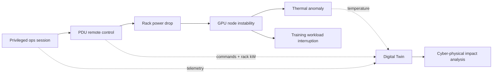

Synthetic metrics include `pdu_commands`, `rack_power_kw`, and `temperature_c`, allowing the project to reason about availability effects across management, power, compute, and workload layers.

## Explainable asset risk

```text
asset risk =
    34% criticality
  + 28% telemetry anomaly
  + 12% structural connectivity
  + 16% simulated scenario exposure
  + privileged / internet-facing surface adjustments
```

Reason codes include:

```text
high_criticality
telemetry_anomaly
on_simulated_attack_path
privileged_surface
internet_exposed
high_connectivity
```

The formula is deliberately auditable. Production implementations could replace components with calibrated ML while preserving the evidence contract.

## API input → output

Run:

```bash
python -m pip install -r requirements-api.txt
uvicorn api.app:app --reload
```

### Input

`POST /simulate`

```json
{
  "scenario": "bmc_compromise",
  "start_asset": "bmc-01-02",
  "max_hops": 3
}
```

### Representative output

```json
{
  "scenario": "bmc_compromise",
  "overall_risk": 0.8284,
  "blast_radius": {
    "start_asset": "bmc-01-02",
    "max_hops": 3,
    "reachable_assets": 9,
    "critical_assets": 4,
    "gpu_nodes": 1,
    "gpus": 4,
    "workloads": 1,
    "models": 0,
    "blast_score": 0.2475
  },
  "resilience": {
    "raw_blast_score": 0.2475,
    "control_reduction": 0.8248,
    "residual_blast_score": 0.0434,
    "resilience_score": 0.9566,
    "active_controls": [
      "bmc_network_segmentation",
      "unique_bmc_credentials",
      "signed_privileged_workloads",
      "model_registry_egress_guard"
    ]
  }
}
```

Endpoints:

```text
GET  /health
GET  /twin
GET  /chokepoints?limit=10
POST /simulate
```

Invalid scenario requests return **HTTP 400**, unknown assets return **HTTP 404**, and invalid query/body bounds are handled by FastAPI validation.

## Security workbench

```bash
python -m pip install -r requirements-dashboard.txt
streamlit run dashboard/app.py
```

Seven views:

1. **Digital Twin** — inventory, zones, criticality, privilege, connectivity.
2. **Attack Path** — ordered scenario steps and ATT&CK-style narrative.
3. **Risk & Telemetry** — explainable asset risk and anomaly evidence.
4. **Blast Radius** — directed reachable assets and GPU/model exposure.
5. **Trust Chokepoints** — structural articulation points and hub ranking.
6. **Control What-if** — raw blast, assumed reduction, residual blast, resilience.
7. **Counterfactual Actions** — simulated defensive recommendations only.

## Quick start

Core simulation:

```bash
python -m digital_twin.demo
```

Full test suite:

```bash
python -m pip install -r requirements-api.txt -r requirements-dashboard.txt
python -m unittest discover -s tests -v
```

Representative CLI output:

```text
AI Data Center Security Digital Twin
assets=57
scenario=bmc_compromise overall_risk=0.828

Counterfactual: compromise bmc-01-02
reachable=9 critical=4 gpu_nodes=1 gpus=4 blast_score=0.247
```

## CI verification

GitHub Actions validates the project on **Python 3.11 and 3.12**. The workflow now:

```text
install API + dashboard dependencies
        ↓
run core + advanced + report + API tests
        ↓
run deterministic CLI demo
        ↓
compile all application modules
        ↓
import FastAPI / Streamlit / Pandas runtime stack
        ↓
launch FastAPI and probe /health
        ↓
launch Streamlit and probe /_stcore/health
        ↓
build Docker image on Python 3.12 job
```

This is deliberately stronger than syntax-only CI: it catches dependency, import, server-startup, API-contract, benchmark-drift, and container-build failures.

## Docker

```bash
docker build -t ai-datacenter-security-twin .
docker run --rm -p 8000:8000 ai-datacenter-security-twin
```

## Project map

```text
ai-datacenter-security-digital-twin/
├── README.md
├── Dockerfile
├── pyproject.toml
├── requirements-api.txt
├── requirements-dashboard.txt
│
├── digital_twin/
│   ├── topology.py          # structural graph + directed attack graph
│   ├── telemetry.py         # security / GPU / thermal / power telemetry
│   ├── attacks.py           # defensive multi-domain scenarios
│   ├── scoring.py           # explainable per-asset risk
│   ├── counterfactual.py    # directed compromise / blast radius
│   ├── attack_surface.py    # articulation points + trust chokepoints
│   ├── resilience.py        # control what-if / residual risk
│   └── demo.py
│
├── api/app.py
├── dashboard/app.py
├── assets/
│   ├── dashboard-overview.svg
│   ├── dashboard-chokepoints.svg
│   ├── dashboard-resilience.svg
│   ├── blast-radius.svg
│   ├── twin-layers.svg
│   ├── telemetry-fusion.svg
│   ├── trust-chokepoints.svg
│   └── control-resilience.svg
├── reports/
│   ├── baseline-evaluation.json
│   └── security-posture.json
├── tests/
│   ├── test_core.py
│   ├── test_advanced.py
│   ├── test_api.py
│   └── test_reports.py
└── .github/workflows/ci.yml
```

## Why a security digital twin?

A SIEM can show suspicious BMC authentication. A DCIM system can show rack power. GPU monitoring can show utilization and thermal behavior. Kubernetes can show workload creation. IAM can show privileged sessions. A model registry can show artifact reads.

The digital twin evaluates those observations **together against a living relationship model**:

```text
alert / infrastructure deviation
              ↓
         affected asset
              ↓
   structural + directed trust context
              ↓
     plausible attack path
              ↓
    downstream AI resources
              ↓
       systemic chokepoint?
              ↓
     directed blast radius
              ↓
   defensive-control what-if
              ↓
    residual risk + priority
```

## Production evolution

A production implementation would replace synthetic fixtures with authorized telemetry and add:

- streaming topology updates from CMDB, Kubernetes, network and facility controllers;
- typed, temporal attack edges with policy/identity context and confidence scores;
- GPU/DCGM, BMC, IAM, eBPF, flow, storage, model-registry and facility telemetry;
- event-time path reconstruction and relationship expiry;
- per-workload seasonality and calibrated anomaly models;
- rack / power / cooling redundancy analysis;
- workload identity and service-account attack relationships;
- model provenance, signing, lineage and artifact-integrity relationships;
- control-policy simulation before containment;
- human approval for disruptive actions;
- telemetry quality, missingness and drift monitoring;
- digital-twin versioning and incident replay;
- multi-site / multi-cluster reachability;
- graph embeddings or GNN challengers to interpretable graph features;
- resilience SLOs such as maximum critical assets reachable from any single management-plane compromise.

## Safety and scope

Everything in this repository is **synthetic and defensive**. It does not connect to production BMCs, Kubernetes clusters, GPUs, credentials, model registries, customer data, power systems, or physical infrastructure. Attack scenarios are abstract simulations used to test detection, graph reasoning, systemic-risk analysis, and defensive architecture choices. Response recommendations are read-only and never execute containment automatically.

The checked-in metrics validate deterministic code paths; they are **not claims about production detection effectiveness, exploitability, control efficacy, or real-world breach probability**.
