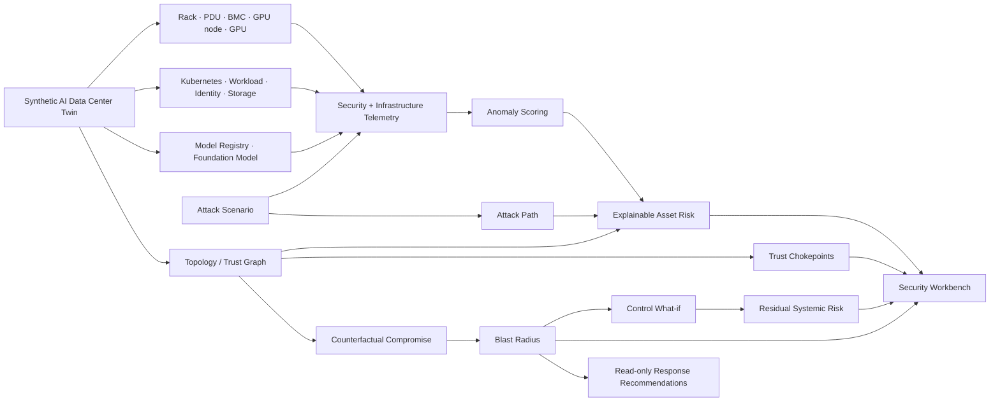
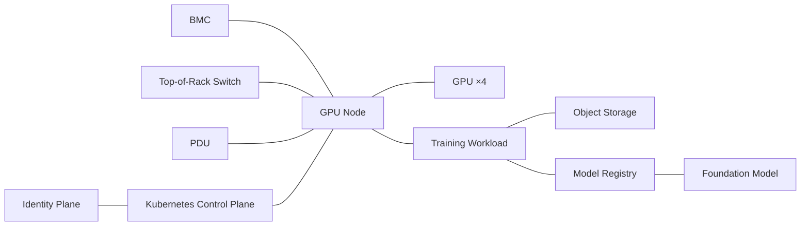
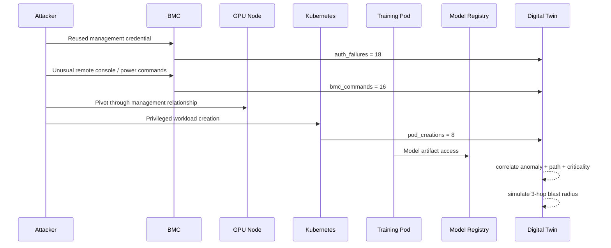
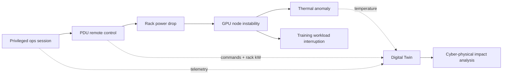

<div align="center">

# 🧠🛡️ AI Data Center Security Digital Twin

### Counterfactual cyber-risk, resilience, and blast-radius simulation for GPU clusters and AI infrastructure

[](https://www.python.org/)
[](https://github.com/VinayK88/ai-datacenter-security-digital-twin/actions/workflows/ci.yml)
[](api/app.py)
[](dashboard/app.py)
[](Dockerfile)
[](#safety-and-scope)

**Model → observe → attack-simulate → correlate → trace → rank → blast-test → harden → compare residual risk**

</div>

---

An AI data center is a tightly coupled cyber-physical system. A single trust relationship can connect a **BMC, PDU, GPU host, Kubernetes control plane, privileged workload, identity service, object store, model registry, and high-value model artifact**.

This repository builds a synthetic security digital twin of that environment and asks four questions that are difficult to answer from isolated alert streams:

> **What is happening?** — correlate security + infrastructure telemetry.
>
> **What can an attacker reach?** — reconstruct paths through the live trust graph.
>
> **What matters systemically?** — identify blast radius and trust chokepoints.
>
> **Which controls change the outcome?** — compare raw vs. residual risk under explicit defensive assumptions.

The core simulator is intentionally dependency-light. Graph traversal, telemetry generation, anomaly scoring, attack simulation, chokepoint analysis, blast-radius analysis, and control what-if calculations use only the Python standard library.

## Dashboard preview

<p align="center">
  
</p>

The Streamlit security workbench now exposes **seven operational views**: Digital Twin, Attack Path, Risk & Telemetry, Blast Radius, Trust Chokepoints, Control What-if, and Counterfactual Actions.

## The digital twin in one picture

<p align="center">
  
</p>

The project deliberately spans three layers rather than treating AI security as only a Kubernetes or model-security problem:

| Layer | Examples |
| --- | --- |
| Physical / management | rack, PDU, BMC, GPU node, GPU, ToR / spine fabric |
| Platform / identity | Kubernetes control plane, workload, admin identity, object storage |
| AI / security | model registry, model artifact, attack paths, blast radius, resilience |

## 60-second architecture



## Default synthetic environment

The deterministic twin contains **57 synthetic assets**:

| Layer | Assets |
| --- | --- |
| Physical / management | 2 racks, 2 PDUs, 6 BMCs |
| Compute | 6 GPU nodes, 24 GPUs |
| Network | perimeter firewall, spine, 2 top-of-rack switches |
| Kubernetes | control plane + 6 training workloads |
| Identity | identity service, privileged admin, ML engineer |
| AI / data | object storage, model registry, `foundation-model-v3` |

A GPU node is not modeled as an isolated server. It is connected to its BMC, rack network, PDU, Kubernetes control plane, local GPUs, workload, model paths, and object storage.



## Cross-domain telemetry fusion

<p align="center">
  
</p>

The simulator correlates signals that would normally live in different platforms:

```text
Identity       auth failures · privileged sessions
BMC            remote console · management commands
Kubernetes     pod creation · privileged workload activity
GPU            utilization · power draw
Thermal        temperature changes
Power          PDU commands · rack-level power draw
Network        east-west / egress volume
Model layer    model-registry artifact reads
```

The important design idea is **contextual correlation**. A high GPU-utilization event alone may be normal. The same signal following a privileged pod creation, a BMC pivot, and unusual egress may be evidence in a multi-stage path.

## Simulated threat scenarios

The twin now includes five defensive scenarios:

| Scenario | Initial surface | Main domains crossed | Illustrative outcome |
| --- | --- | --- | --- |
| `bmc_compromise` | remote management plane | BMC → compute → K8s → model | privileged workload + model access |
| `model_exfiltration` | stolen ML identity | IAM → registry → storage → network | bulk model artifact transfer |
| `rogue_workload` | Kubernetes control plane | K8s → workload → host → model | unsigned privileged execution |
| `cryptomining` | compromised workload | workload → GPU → power → network | off-schedule GPU resource hijack |
| `power_control_abuse` | privileged operations session | IAM → PDU → GPU node → workload | cyber-physical service disruption |

Scenario steps use representative ATT&CK-style technique names to communicate the defensive narrative. They are intentionally abstract and are not exploit instructions.

## Example — BMC compromise



The deterministic fixture produces these top risk signals:

| Asset | Risk | Why it rises |
| --- | ---: | --- |
| `gpu-node-01-02` | **0.9660** | max anomaly + simulated attack path + privilege + connectivity |
| `model-registry-01` | **0.9149** | criticality + model-read anomaly + path exposure |
| `bmc-01-02` | **0.8593** | authentication/BMC-command anomaly + privileged surface |

Overall synthetic environment risk for this scenario: **0.8284**.

## Counterfactual blast-radius simulation

Detection is only the first question. The twin can also ask:

```text
WHAT IF bmc-01-02 IS COMPROMISED RIGHT NOW?
```

and traverse the actual synthetic trust graph to estimate downstream exposure.

<p align="center">
  
</p>

### Deterministic 3-hop comparison

| Metric | BMC compromise | Kubernetes control-plane compromise |
| --- | ---: | ---: |
| Reachable assets | **20** | **57** |
| Critical assets | **12** | **20** |
| GPU nodes exposed | **6** | **6** |
| GPUs exposed | **4** | **24** |
| Workloads exposed | **1** | **6** |
| Model assets exposed | **0** | **1** |
| Blast score | **0.4695** | **0.7728** |

This highlights a central digital-twin idea: **risk and systemic impact are different quantities**. Two assets with similar local risk can have very different consequences because of their position in the trust graph.

## Systemic trust chokepoints

<p align="center">
  
</p>

`digital_twin/attack_surface.py` adds topology-first security analysis. It calculates graph articulation points and ranks assets using an inspectable combination of:

```text
42% normalized graph degree
33% asset criticality
17% articulation-point status
 8% privileged-surface adjustment
```

This answers a different question from anomaly detection:

> **Which assets can become architectural single points of failure or high-value pivot hubs even before they generate an alert?**

The analysis is useful for security architecture reviews because it can surface control-plane, identity, network, compute, and cyber-physical dependencies that deserve stronger segmentation or monitoring.

## Defensive control what-if simulation

The twin can now model **residual risk**, not just raw impact.

<p align="center">
  
</p>

For the BMC scenario, the current synthetic control catalog includes:

| Control | Illustrative effectiveness assumption |
| --- | ---: |
| management-plane segmentation | 48% |
| unique / strongly protected BMC credentials | 26% |
| signed privileged-workload enforcement | 34% |
| model-registry egress guard | 31% |

Because the controls are combined as independent residual-risk reducers in this **illustrative** model, the BMC scenario changes from:

```text
raw blast score       0.4695
combined reduction    82.5%
residual blast score  0.0823
resilience score      0.9177
```

These values are transparent simulation assumptions — **not empirical breach probabilities or measured control efficacy**. The purpose is to demonstrate how a digital twin can compare architecture choices before making disruptive changes.

Other controls in the catalog cover cluster-admin access, GPU-workload egress, model-registry access, and remote PDU operations.

## Cyber-physical scenario — power control abuse

The new `power_control_abuse` scenario extends the project beyond conventional cloud/security telemetry:



New synthetic metrics include:

```text
pdu_commands
rack_power_kw
temperature_c
```

This makes it possible to reason about an AI facility as a **cyber-physical system**, where management-plane compromise can affect compute availability and active training workloads.

## Explainable asset risk

For each asset, the project combines five inspectable factors:

```text
asset risk =
    34% criticality
  + 28% telemetry anomaly
  + 12% graph connectivity
  + 16% simulated attack-path exposure
  + privileged / internet-facing surface adjustments
```

Reason codes include:

```text
high_criticality
telemetry_anomaly
on_simulated_attack_path
privileged_surface
internet_exposed
high_connectivity
```

The formula is deliberately simple enough to audit. A production system could replace components with calibrated ML or seasonality-aware anomaly models while preserving the same evidence contract.

## API input → output

Run the API:

```bash
python -m pip install -r requirements-api.txt
uvicorn api.app:app --reload
```

### Input

`POST /simulate`

```json
{
  "scenario": "bmc_compromise",
  "start_asset": "bmc-01-02",
  "max_hops": 3
}
```

### Representative output

```json
{
  "scenario": "bmc_compromise",
  "overall_risk": 0.8284,
  "top_risky_assets": [
    {
      "asset_id": "gpu-node-01-02",
      "risk": 0.966,
      "reasons": [
        "high_criticality",
        "telemetry_anomaly",
        "on_simulated_attack_path",
        "privileged_surface",
        "high_connectivity"
      ]
    },
    {
      "asset_id": "model-registry-01",
      "risk": 0.9149,
      "reasons": [
        "high_criticality",
        "telemetry_anomaly",
        "on_simulated_attack_path",
        "privileged_surface",
        "high_connectivity"
      ]
    }
  ],
  "blast_radius": {
    "start_asset": "bmc-01-02",
    "max_hops": 3,
    "reachable_assets": 20,
    "critical_assets": 12,
    "gpu_nodes": 6,
    "gpus": 4,
    "workloads": 1,
    "models": 0,
    "blast_score": 0.4695
  }
}
```

Other endpoints:

```text
GET /health
GET /twin
POST /simulate
```

## Security workbench

```bash
python -m pip install -r requirements-dashboard.txt
streamlit run dashboard/app.py
```

The dashboard now has **seven** operational views:

1. **Digital Twin** — inventory, zones, criticality, privilege, connectivity.
2. **Attack Path** — ordered scenario steps and ATT&CK-style narrative.
3. **Risk & Telemetry** — explainable asset risk and anomaly evidence.
4. **Blast Radius** — reachable assets, critical systems, GPU/model exposure.
5. **Trust Chokepoints** — articulation points and systemic hub ranking.
6. **Control What-if** — raw blast, assumed control reduction, residual blast, resilience.
7. **Counterfactual Actions** — simulated defensive recommendations only.

## Quick start — core path has no third-party dependencies

```bash
python -m digital_twin.demo
python -m unittest discover -s tests -v
```

Example CLI output begins with:

```text
AI Data Center Security Digital Twin
assets=57
scenario=bmc_compromise overall_risk=0.828

Counterfactual: compromise bmc-01-02
reachable=20 critical=12 gpu_nodes=6 gpus=4 blast_score=0.469
```

## Docker

```bash
docker build -t ai-datacenter-security-twin .
docker run --rm -p 8000:8000 ai-datacenter-security-twin
```

## Project map

```text
ai-datacenter-security-digital-twin/
├── README.md
├── Dockerfile
├── pyproject.toml
├── requirements-api.txt
├── requirements-dashboard.txt
│
├── digital_twin/
│   ├── topology.py          # asset + trust graph
│   ├── telemetry.py         # security / GPU / thermal / power telemetry
│   ├── attacks.py           # defensive multi-domain scenarios
│   ├── scoring.py           # explainable per-asset risk
│   ├── counterfactual.py    # compromise / blast-radius simulation
│   ├── attack_surface.py    # articulation points + trust chokepoints
│   ├── resilience.py        # defensive-control what-if / residual risk
│   └── demo.py
│
├── api/
│   └── app.py
├── dashboard/
│   └── app.py
├── assets/
│   ├── dashboard-overview.svg
│   ├── blast-radius.svg
│   ├── twin-layers.svg
│   ├── telemetry-fusion.svg
│   ├── trust-chokepoints.svg
│   └── control-resilience.svg
├── reports/
│   └── baseline-evaluation.json
├── tests/
│   ├── test_core.py
│   └── test_advanced.py
└── .github/workflows/ci.yml
```

## Why a security digital twin?

A SIEM can show suspicious BMC authentication. A DCIM system can show rack power. GPU monitoring can show utilization and thermal behavior. Kubernetes can show workload creation. IAM can show privileged sessions. A model registry can show artifact reads.

The digital-twin concept becomes valuable when those observations are evaluated **together against a living relationship model**:

```text
alert / infrastructure deviation
              ↓
         affected asset
              ↓
      topology + trust graph
              ↓
     plausible attack path
              ↓
    downstream AI resources
              ↓
       systemic chokepoint?
              ↓
          blast radius
              ↓
   defensive-control what-if
              ↓
    residual risk + priority
```

That is the architectural idea this repository demonstrates.

## Production evolution

A production implementation would replace synthetic fixtures with authorized telemetry and add:

- streaming topology updates from CMDB, Kubernetes, network and facility controllers;
- GPU/DCGM, BMC, IAM, eBPF, flow, storage, model-registry and facility telemetry;
- temporal graph storage and event-time attack paths;
- directed trust edges and privilege-aware reachability instead of purely undirected topology;
- per-workload seasonality and calibrated anomaly models;
- rack / power / cooling dependency modeling and redundancy analysis;
- workload identity and service-account attack relationships;
- model provenance, signing, lineage and artifact-integrity relationships;
- control-policy simulation before containment;
- scenario replay for architecture-change testing;
- human approval for disruptive actions;
- telemetry quality, missingness and drift monitoring;
- digital-twin versioning for incident reconstruction;
- multi-site / multi-cluster blast-radius analysis;
- graph embeddings or GNN research as a challenger to interpretable graph features;
- resilience SLOs such as maximum critical assets reachable from any single management-plane compromise.

## Safety and scope

Everything in this repository is **synthetic and defensive**. It does not connect to production BMCs, Kubernetes clusters, GPUs, credentials, model registries, customer data, power systems, or physical infrastructure. Attack scenarios are abstract simulations used to test detection, graph reasoning, systemic-risk analysis, and defensive architecture choices. Response recommendations are read-only and are never executed automatically.

The checked-in metrics validate deterministic code paths; they are **not claims about production detection effectiveness, exploitability, control efficacy, or real-world breach probability**.
