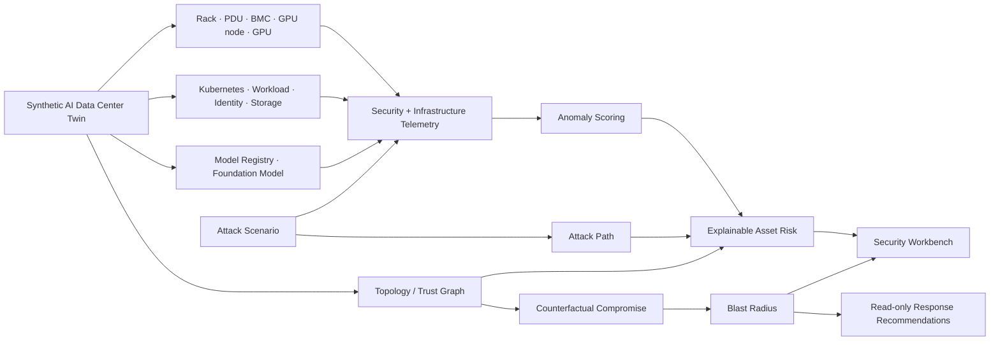
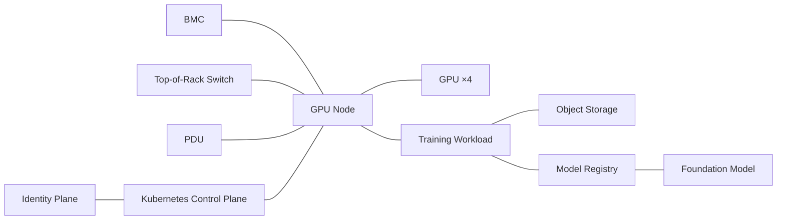
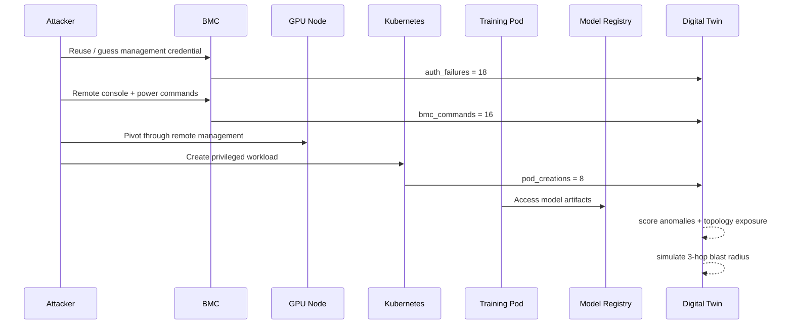
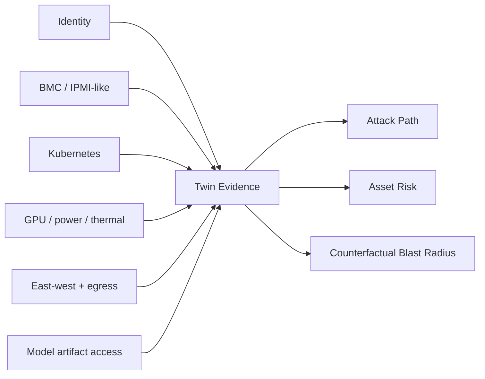

<div align="center">

# 🧠🛡️ AI Data Center Security Digital Twin

### Counterfactual cyber-risk simulation for GPU clusters, AI workloads, control planes, BMCs, identities, and model assets

[](https://www.python.org/)
[](https://github.com/VinayK88/ai-datacenter-security-digital-twin/actions/workflows/ci.yml)
[](api/app.py)
[](dashboard/app.py)
[](Dockerfile)
[](#safety-and-scope)

**Model the infrastructure → inject an attack → observe telemetry → trace paths → calculate blast radius → simulate defensive action**

</div>

---

An AI data center is not just a collection of servers. A single trust relationship can connect a **BMC, GPU host, Kubernetes control plane, privileged workload, object store, model registry, identity plane, and high-value model artifact**.

This project builds a synthetic security digital twin of that environment and asks a question traditional alert dashboards usually cannot answer directly:

> **If this asset is compromised right now, what can an attacker reach, which AI resources are exposed, how large is the blast radius, and what defensive action should be prioritized?**

The twin is deliberately inspectable and dependency-light. Core graph traversal, telemetry generation, anomaly scoring, attack simulation, asset risk, and counterfactual blast-radius analysis use only the Python standard library.

## Dashboard preview

<p align="center">
  
</p>

The live Streamlit workbench exposes the **digital-twin inventory, attack path, explainable asset risk, telemetry anomalies, blast radius, and defensive recommendations** in one analyst view.

## 60-second architecture



## What the twin models

The deterministic default environment contains **57 synthetic assets**:

| Layer | Assets |
| --- | --- |
| Physical / management | 2 racks, 2 PDUs, 6 BMCs |
| Compute | 6 GPU nodes, 24 GPUs |
| Network | perimeter firewall, spine, 2 top-of-rack switches |
| Kubernetes | control plane + 6 training workloads |
| Identity | identity service, privileged admin, ML engineer |
| AI / data | object storage, model registry, `foundation-model-v3` |

The relationships matter as much as the inventory. For example, a GPU node is connected to its BMC, rack network, PDU, Kubernetes control plane, local GPUs, workload, model paths, and object storage.



## Simulated threat scenarios

RiskOS-style scoring is not reused here; the twin has infrastructure-specific scenarios and evidence.

| Scenario | Initial surface | Example path / outcome |
| --- | --- | --- |
| `bmc_compromise` | remote management plane | BMC → GPU node → privileged workload → model registry |
| `model_exfiltration` | stolen ML identity | identity → model registry → object store → outbound transfer |
| `rogue_workload` | Kubernetes control plane | privileged pod → host resources → model artifacts |
| `cryptomining` | compromised workload | GPU saturation → abnormal power → mining-pool-like egress |

Scenario steps include representative ATT&CK-style technique names to make the defensive narrative easier to communicate. They are not intended to be a complete ATT&CK coverage matrix.

## Example — BMC compromise



The deterministic fixture produces the following top risk signals:

| Asset | Risk | Why it rises |
| --- | ---: | --- |
| `gpu-node-01-02` | **0.9660** | max anomaly + simulated attack path + privilege + high connectivity |
| `model-registry-01` | **0.9149** | high criticality + model-read anomaly + attack-path exposure |
| `bmc-01-02` | **0.8593** | authentication/BMC-command anomaly + privileged management surface |

Overall synthetic environment risk for this scenario: **0.8284**.

## Counterfactual security simulation

The core differentiator is not merely detecting an anomaly. The twin can ask:

```text
WHAT IF bmc-01-02 IS COMPROMISED?
```

and traverse real relationships in the synthetic environment to estimate downstream exposure.

<p align="center">
  
</p>

### Deterministic 3-hop result

| Metric | BMC compromise | Kubernetes control-plane compromise |
| --- | ---: | ---: |
| Reachable assets | **20** | **57** |
| Critical assets | **12** | **20** |
| GPU nodes exposed | **6** | **6** |
| GPUs exposed | **4** | **24** |
| Workloads exposed | **1** | **6** |
| Model assets exposed | **0** | **1** |
| Blast score | **0.4695** | **0.7728** |

This makes the security implication visible: two high-risk assets can have very different **systemic consequences** because their graph position and trust relationships differ.

## Explainable risk model

For each asset, the project combines five inspectable factors:

```text
asset risk =
    34% criticality
  + 28% telemetry anomaly
  + 12% graph connectivity
  + 16% simulated attack-path exposure
  + privileged / internet-facing surface adjustments
```

Reason codes include:

```text
high_criticality
telemetry_anomaly
on_simulated_attack_path
privileged_surface
internet_exposed
high_connectivity
```

The formula is intentionally simple enough to audit. A production system could replace individual components with calibrated ML/anomaly models while preserving the same evidence contract.

## Telemetry layer

The synthetic telemetry generator covers signals such as:

```text
gpu_utilization
gpu_power_watts
egress_mbps
auth_failures
bmc_commands
pod_creations
model_reads
temperature_c
```

Normal observations are generated around deterministic baselines. Attack scenarios inject high-signal deviations, and `digital_twin.telemetry.anomaly_score()` converts the deviation to a bounded 0–1 score.

This lets the project correlate traditionally separate data domains:



## API input → output

Run the API:

```bash
python -m pip install -r requirements-api.txt
uvicorn api.app:app --reload
```

### Input

`POST /simulate`

```json
{
  "scenario": "bmc_compromise",
  "start_asset": "bmc-01-02",
  "max_hops": 3
}
```

### Representative output

```json
{
  "scenario": "bmc_compromise",
  "overall_risk": 0.8284,
  "top_risky_assets": [
    {
      "asset_id": "gpu-node-01-02",
      "risk": 0.966,
      "reasons": [
        "high_criticality",
        "telemetry_anomaly",
        "on_simulated_attack_path",
        "privileged_surface",
        "high_connectivity"
      ]
    },
    {
      "asset_id": "model-registry-01",
      "risk": 0.9149,
      "reasons": [
        "high_criticality",
        "telemetry_anomaly",
        "on_simulated_attack_path",
        "privileged_surface",
        "high_connectivity"
      ]
    }
  ],
  "blast_radius": {
    "start_asset": "bmc-01-02",
    "max_hops": 3,
    "reachable_assets": 20,
    "critical_assets": 12,
    "gpu_nodes": 6,
    "gpus": 4,
    "workloads": 1,
    "models": 0,
    "blast_score": 0.4695,
    "recommendations": [
      "isolate BMC management network from workload fabric",
      "rotate BMC credentials and disable shared administrator accounts",
      "validate firmware integrity before restoring remote management",
      "cordon affected GPU nodes and preserve runtime evidence"
    ]
  }
}
```

Other endpoints:

```text
GET /health
GET /twin
POST /simulate
```

## Dashboard

```bash
python -m pip install -r requirements-dashboard.txt
streamlit run dashboard/app.py
```

The workbench has five views:

1. **Digital Twin** — inventory, zones, criticality, privilege, and graph degree.
2. **Attack Path** — ordered scenario steps, objective, and ATT&CK-style mapping.
3. **Risk & Telemetry** — explainable asset risk, anomaly evidence, and charts.
4. **Blast Radius** — reachable/critical assets, GPU exposure, model exposure.
5. **Counterfactual Actions** — simulated defensive recommendations only.

## Quick start — no third-party dependencies

```bash
python -m digital_twin.demo
python -m unittest discover -s tests -v
```

Example CLI output begins with:

```text
AI Data Center Security Digital Twin
assets=57
scenario=bmc_compromise overall_risk=0.828

Counterfactual: compromise bmc-01-02
reachable=20 critical=12 gpu_nodes=6 gpus=4 blast_score=0.469
```

## Docker

```bash
docker build -t ai-datacenter-security-twin .
docker run --rm -p 8000:8000 ai-datacenter-security-twin
```

## Project map

```text
ai-datacenter-security-digital-twin/
├── README.md
├── Dockerfile
├── pyproject.toml
├── requirements-api.txt
├── requirements-dashboard.txt
│
├── digital_twin/
│   ├── topology.py        # asset + trust graph
│   ├── telemetry.py       # synthetic telemetry + anomaly score
│   ├── attacks.py         # defensive attack scenarios
│   ├── scoring.py         # explainable per-asset risk
│   ├── counterfactual.py  # compromise / blast-radius simulation
│   └── demo.py
│
├── api/
│   └── app.py
├── dashboard/
│   └── app.py
├── assets/
│   ├── dashboard-overview.svg
│   └── blast-radius.svg
├── reports/
│   └── baseline-evaluation.json
├── tests/
│   └── test_core.py
└── .github/workflows/ci.yml
```

## Why a security digital twin?

A SIEM can tell an analyst that a BMC generated suspicious authentication events. A topology graph can tell them what the BMC is connected to. A GPU monitoring system can show utilization and power. A Kubernetes control plane can show pod creation. A model registry can show artifact access.

The digital-twin concept becomes useful when those observations are evaluated **together against a living relationship model**:

```text
alert
  → affected asset
  → trust relationships
  → plausible attack path
  → downstream AI assets
  → blast radius
  → prioritized defensive action
```

That is the architectural idea this repository demonstrates.

## Production evolution

A real implementation would replace synthetic fixtures with authorized telemetry and add:

- streaming topology updates from CMDB / Kubernetes / network controllers;
- GPU/DCGM, BMC, IAM, eBPF, flow, storage, and model-registry telemetry;
- temporal graph storage and event-time attack paths;
- online anomaly models with per-workload seasonality;
- workload identity and service-account attack relationships;
- model provenance, artifact signing, and data-lineage relationships;
- policy simulation before containment;
- human approval for disruptive response actions;
- telemetry data-quality and drift monitoring;
- digital-twin versioning and replay for incident reconstruction;
- multi-site / multi-cluster blast-radius analysis.

## Safety and scope

Everything in this repository is **synthetic and defensive**. It does not connect to production BMCs, Kubernetes clusters, GPUs, credentials, model registries, customer data, or physical infrastructure. Attack scenarios are abstract simulations used to test detection, graph reasoning, and incident-impact analysis. Response recommendations are read-only and are never executed automatically.

The checked-in metrics validate deterministic code paths; they are **not claims about production detection effectiveness or real-world breach probability**.
